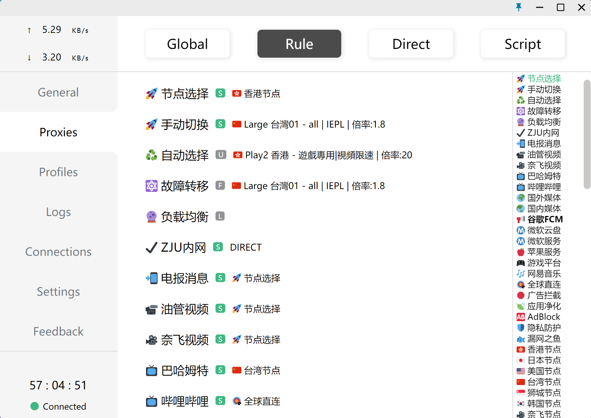

# MyRules

继承自[SubConv/ZJU-Rule](https://github.com/SubConv/ZJU-Rule)与[lizhist/ZJU-Rule](https://github.com/lizhist/ZJU-Rule)

基于 [ACL4SSR](https://github.com/ACL4SSR/ACL4SSR) 修改后的 ZJU 分流规则

项目使用 CC-BY-SA-4.0 协议发布 

## 支持功能

+ ZJU 内网资源/学术资源分流（直连访问/ RVPN访问）
+ 节点自动选择
+ 节点故障转移
+ 节点负载均衡
+ Telegram 分流
+ Youtube 分流
+ Netflix 分流
+ 动画疯分流
+ 哔哩哔哩分流（解锁港澳台）
+ Google 服务分流
+ OneDrive 分流
+ Microsoft 服务分流
+ Apple 服务分流
+ 游戏平台分流（Steam/Epic/Sony）
+ 网易云音乐分流（灰色歌曲解锁）
+ 广告拦截/应用净化/AdBlock/隐私防护
+ 节点分地区管理（香港/日本/美国/台湾/狮城/韩国）
+ ...

## 使用方法

### 安装 Clash

+ 使用 [Clash](https://github.com/Dreamacro/clash) 作为代理工具，此工具支持 SS/SSR/V2Ray/Trojan/HTTP/HTTPS/SOCKS 等多种协议。不同平台的客户端如下：

  + Windows: [Clash for Windows](https://github.com/Fndroid/clash_for_windows_pkg/releases)
  + Mac: [ClashX](https://github.com/yichengchen/clashX/releases) 或 [Clash for Windows](https://github.com/Fndroid/clash_for_windows_pkg/releases)
  + Android/HarmonyOS: [Clash for Android](https://github.com/Kr328/ClashForAndroid/releases)

+ 建议取消客户端默认开启的绕过 10.0.0.0/8 IP 段功能。10.0.0.0/8 作为 ZJU 内网 IP 段，已在 ZJU Rule 中进行正确配置。取消绕过该段后，可以实现在 Clash 中内网穿透等高级功能。以 Clash for Windows 为例，编辑 Settings - Bypass Domain/IPNet，去除以 10 开头的行

### 转换订阅链接

+ 无论机场提供的订阅链接是 SS/SSR/V2Ray 等订阅链接，还是 Clash 订阅链接，都需要提取出其中的节点信息，再按照 ZJU Rule 进行处理，生成处理后的 Clash 订阅链接

+ 订阅转换需要使用 [subconverter](https://github.com/tindy2013/subconverter)，可使用[ACL4SSR](https://github.com/ACL4SSR/ACL4SSR/tree/master)提供的[前端转换服务](https://acl4ssr-sub.github.io/) + [subconverter后端接口](https://github.com/tindy2013/subconverter)，也可以自己搭建 [subconverter](https://github.com/tindy2013/subconverter) 并使用 ZJU Rule 规则进行订阅转换

+ 注意，使用公用规则转换服务可能会导致订阅泄露，推荐自行搭建，参考[subconv文档](https://subconv.is-sb.com/)

+ 若要为其他客户端生成订阅链接，可以直接更改链接中的 target 参数，参考 [subconverter](https://github.com/tindy2013/subconverter) 文档

### 配置分流方式

Clash 采用继承的分流配置方式，例如，巴哈姆特设置为使用台湾节点，则将使用台湾节点分组中选中的节点进行代理。可以根据自己的需要进行配置，如将哔哩哔哩配置为香港/台湾节点以访问港澳台资源

### 修改分组规则

公用转换服务使用 [ZJU.ini](https://github.com/P1anet/MyRules/blob/master/Clash/config/ZJU.ini) 作为规则分组文件。该文件修改自 [ACL4SSR_Online_Full_AdblockPlus.ini](https://github.com/P1anet/MyRules/blob/master/Clash/config/ACL4SSR_Online_Full_AdblockPlus.ini)，添加了 [ZJU.list](https://github.com/P1anet/MyRules/blob/master/Clash/ZJU.list)。如要修改规则分组，请 Fork 本项目，自行搭建 [subconverter](https://github.com/tindy2013/subconverter) 并编辑 [ZJU.ini](https://github.com/P1anet/MyRules/blob/master/Clash/config/ZJU.ini) 进行转换

### 对 ZJU Rule 进行完善

欢迎通过 Issue 提出意见或建议，或提交 Pull Request 完善规则。ZJU 内网规则之外的规则请向项目上游 [ACL4SSR](https://github.com/ACL4SSR/ACL4SSR/tree/master) 进行反馈，上游不予采纳时也可以向 ZJU Rule 提交

## 致谢

+ [ACL4SSR](https://github.com/ACL4SSR/ACL4SSR/tree/master)
+ [subconverter](https://github.com/tindy2013/subconverter)
+ [Clash](https://github.com/Dreamacro/clash)
+ [SubConv/ZJU-Rule](https://github.com/SubConv/ZJU-Rule)
+ [lizhist/ZJU-Rule](https://github.com/lizhist/ZJU-Rule)